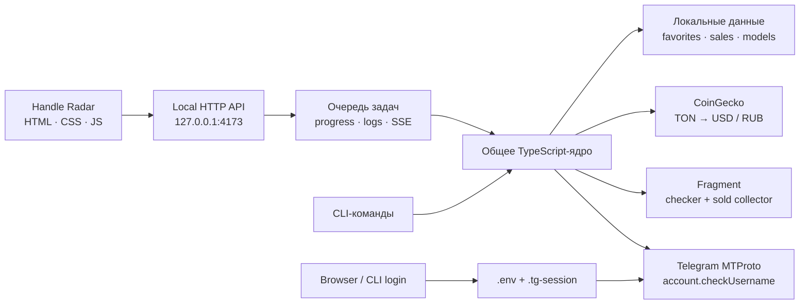
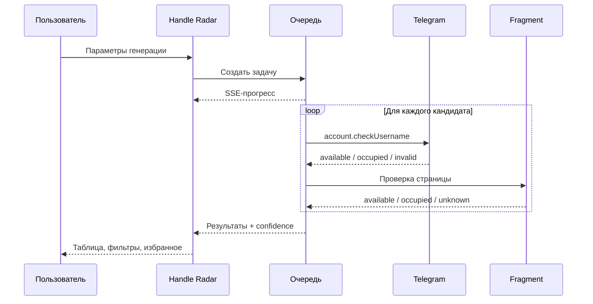

<div align="center">

# Handle Radar

### Telegram & Fragment Username Intelligence

Локальная рабочая станция для поиска, проверки и оценки юзернеймов — с официальным Telegram MTProto, аналитикой Fragment и собственными ML-моделями.

[](https://nodejs.org/)
[](https://www.typescriptlang.org/)


</div>

---

**Handle Radar** объединяет современный браузерный интерфейс и полноценный CLI. Он генерирует кандидатов, проверяет доступность в Telegram и на Fragment, сохраняет избранное, собирает публичную историю продаж и обучает локальные модели — без облачной панели и передачи учётных данных третьим лицам.

> [!IMPORTANT]
> Приложение помогает исследовать доступность имён, но не регистрирует и не покупает их автоматически. Перед регистрацией или покупкой всегда перепроверяйте результат на официальной площадке.

## Возможности

| Направление | Что умеет Handle Radar |
|---|---|
| **Поиск** | Слоговые, случайные и word-based генераторы; длина, цифры, алфавит, позиция слова |
| **Telegram** | Официальная проверка через `account.checkUsername` и разовая MTProto-авторизация |
| **Fragment** | Разбор актуальных состояний страницы, отдельный режим для collectible-имён длиной от 4 символов |
| **Надёжность** | Независимые статусы `available`, `invalid`, `unknown` и уровень уверенности каждого источника |
| **Продажи** | Collector завершённых продаж Fragment с дедупликацией и несколькими market views |
| **ML** | Локальная модель оценки цены и посимвольный генератор кандидатов |
| **Рабочий процесс** | Очередь фоновых задач, live-логи через SSE, избранное и экспорт JSON |
| **Приватность** | Сервер только на `127.0.0.1`, локальные credentials, CSP и защита изменяющих API-запросов |

## Содержание

- [Быстрый старт](#быстрый-старт)
- [Веб-интерфейс](#локальный-веб-интерфейс)
- [Авторизация Telegram](#настройка-telegram)
- [Поиск через CLI](#поиск-через-cli)
- [Collector и ML-модели](#данные-и-модели-v5)
- [Архитектура](#архитектура)
- [Тесты и сборка](#проверка-проекта)
- [Безопасность](#локальность-и-безопасность)
- [Решение проблем](#решение-проблем)

## Быстрый старт

Требования: **Node.js 20+**, npm и собственные `api_id` / `api_hash` Telegram.

```powershell
# 1. Установить точные версии зависимостей из package-lock.json
npm ci

# 2. Создать локальный файл конфигурации
Copy-Item .env.example .env

# 3. Заполнить TG_API_ID и TG_API_HASH, затем авторизоваться
npm run login

# 4. Запустить Handle Radar
npm run web
```

Откройте **http://127.0.0.1:4173**. Те же шаги можно пройти без терминального login в разделе **Настройка** самого интерфейса.

## Важно прочитать перед использованием

- **Telegram проверяется официальным методом** `account.checkUsername` через MTProto. Это тот же серверный вызов, который используется при выборе username в Telegram. Для проверки нужен разовый вход под своим аккаунтом.
- **У Fragment нет публичного API**, поэтому checker и collector разбирают текущую HTML-разметку сайта. Явные состояния страницы распознаются уверенно, а выводы по косвенным признакам помечаются как эвристика.
- По умолчанию `--source both`: Telegram и Fragment проверяются вместе. Имя не выдаётся за гарантированно свободное, если один из источников не проверялся или вернул неопределённый/эвристический результат.
- Обычные Telegram-юзернеймы имеют длину **5–32 символа**. Четырёхсимвольные collectible-имена генерируются только при `--source fragment`; для `telegram` и `both` минимум остаётся равным 5.
- Не уменьшайте `--delay` без необходимости. Значение по умолчанию — 2000 мс с небольшим джиттером между запросами.
- Инструмент предназначен для личного поиска и исследования, а не для агрессивного скрапинга или спама.

## Установка

Для воспроизводимой установки используйте lock-файл:

```bash
npm ci
```

Если вы намеренно обновляете зависимости, используйте `npm install` и проверьте изменения в `package-lock.json`.

Playwright — опциональный запасной JS-рендер для Fragment:

```bash
npx playwright install chromium
```

Он нужен только при использовании флага `--playwright`.

## Локальный веб-интерфейс

Для обычной локальной разработки и использования:

```bash
npm run web
```

После запуска откройте [http://127.0.0.1:4173](http://127.0.0.1:4173).

Для запуска с предварительно собранным TypeScript:

```bash
npm run build && npm start
```

Интерфейс разделён на четыре рабочих раздела:

1. **Поиск** — параметры генерации, проверка Telegram/Fragment, расширенные флаги, live-прогресс и таблица результатов с уровнем уверенности.
2. **Модели** — сбор продаж Fragment, обучение модели цены и генератора, нейрогенерация, показатели локального датасета и история задач.
3. **Избранное** — добавление заметок, фильтрация по Telegram/Fragment и удаление сохранённых вариантов.
4. **Настройка** — сохранение Telegram API ID/API Hash, пошаговый вход по номеру, коду и 2FA, а также проверка готовности MTProto-сессии.

Длительные операции выполняются через локальную очередь по одной задаче, поэтому сбор данных, обучение и поиск не конфликтуют за Telegram-сессию. Прогресс и логи обновляются в интерфейсе без перезагрузки страницы.

### Локальность и безопасность

- Сервер слушает только `127.0.0.1`, проверяет локальный `Host`, а для изменяющих запросов — также `Origin`, если браузер его прислал.
- Ответы получают CSP и другие защитные HTTP-заголовки; облачной синхронизации в приложении нет.
- HTML, JavaScript, стили и шрифтовые стеки работают из локальных файлов и системных шрифтов — интерфейс не загружает UI-ресурсы со сторонних CDN.
- API ID/API Hash сохраняются в `.env`, MTProto-сессия — в `.tg-session`. API Hash и строка сессии не отправляются обратно в браузер.
- `.env` и `.tg-session` находятся в `.gitignore`. Там же находятся `favorites.json`, `models/`, `debug/` и служебная `.runtime/`.
- История публичных продаж хранится в `data/sold-history.json`; кэш курсов — в `data/rates-cache.json`.
- Локальность интерфейса не означает работу без сети: проверки обращаются к Telegram и Fragment, collector — к Fragment, а конвертация цены — к публичному CoinGecko API.

Не публикуйте `.env` и `.tg-session` и не передавайте их другим людям.

## Настройка Telegram

Настроить Telegram можно в разделе **Настройка** веб-интерфейса либо через CLI:

1. Войдите на [my.telegram.org](https://my.telegram.org) под своим номером.
2. Откройте **API development tools** и создайте приложение.
3. Скопируйте `.env.example` в `.env` и заполните `TG_API_ID` / `TG_API_HASH`.

   PowerShell:

   ```powershell
   Copy-Item .env.example .env
   ```

   Bash:

   ```bash
   cp .env.example .env
   ```

4. Выполните разовый вход:

   ```bash
   npm run login
   ```

После номера телефона, кода и при необходимости 2FA-пароля сессия сохранится в `.tg-session`. Повторный вход не нужен, пока Telegram-сессия не будет отозвана.

Если вход через MTProto использовать нельзя, у `search` остаётся `--legacy-web`. Он разбирает `t.me/<username>`, имеет низкую уверенность и может ошибаться, поэтому подходит только как явный временный фолбэк.

### Если появляется `connect EACCES ...:443`

Это не ошибка API ID, API Hash, кода или 2FA. `EACCES` означает, что Windows либо среда запуска запретила процессу `node.exe` открыть TCP-соединение с Telegram. Такое возможно, если локальный сервер был запущен из IDE/Codex-песочницы.

1. Остановите текущий сервер.
2. Откройте обычный PowerShell в папке проекта.
3. Запустите `npm run web`.
4. Если Windows покажет запрос брандмауэра, разрешите `node.exe` доступ к частной сети.

Существующая `.tg-session` при этом остаётся действующей; повторный вход нужен только если Telegram отозвал сессию или интерфейс явно сообщает, что она не авторизована.

## Поиск через CLI

```bash
npm run search -- --mode both --min-length 5 --max-length 6 --digits exclude --count 30
```

Ключевые флаги:

| Флаг | Значения | Описание |
|---|---|---|
| `--source` | `telegram` \| `fragment` \| `both` | Где проверять; по умолчанию `both` |
| `--mode` | `readable` \| `random` \| `word` \| `both` | Слоговые, случайные, с обязательным словом или оба обычных генератора |
| `--min-length`, `--max-length` | число | Диапазон 5–32 для `telegram`/`both`; диапазон 4–32 разрешён только для `fragment` |
| `--digits` | `exclude` \| `allow` \| `require` | Исключить цифры, разрешить или потребовать хотя бы одну |
| `--count` | число | Максимальное число уникальных кандидатов; `both` не возвращает больше этого лимита |
| `--charset` | строка | Собственный набор латинских букв для `random`/`word` |
| `--word` | текст | Обязательное слово для `--mode word`; первая буква латинская, далее допустимы буквы и цифры |
| `--word-position` | `start` \| `middle` \| `end` \| `any` | Позиция обязательного слова |
| `--delay` | мс | Пауза между запросами; по умолчанию 2000 |
| `--out` | путь | Сохранить кандидатов/результаты в JSON |
| `--debug` | флаг | Сохранять диагностический HTML Fragment в `debug/` |
| `--dry-run` | флаг | Только сгенерировать кандидатов, без сети |
| `--playwright` | флаг | Подключить JS-рендер Fragment как фолбэк |
| `--legacy-web` | флаг | Использовать HTML-проверку Telegram вместо MTProto |
| `--estimate-price` | флаг | Оценить цену найденных имён после `npm run train-price` |

Примеры:

```bash
# Только генерация без сетевых запросов
npm run search -- --mode readable --min-length 6 --max-length 8 --digits allow --count 20 --dry-run

# Полная проверка Telegram + Fragment
npm run search -- --source both --mode readable --min-length 5 --max-length 6 --digits exclude --count 50 --out results.json

# Проверка только Telegram: минимум всегда 5
npm run search -- --source telegram --mode both --min-length 5 --max-length 7 --digits allow --count 20

# Четырёхсимвольные collectible-кандидаты только для Fragment
npm run search -- --source fragment --mode random --min-length 4 --max-length 4 --digits exclude --count 20

# Слово "big" в начале имени
npm run search -- --mode word --word big --word-position start --min-length 5 --max-length 8 --count 20 --dry-run
```

Если пространство вариантов слишком узкое — например, задан один символ и фиксированная короткая длина, — генератор вернёт меньше `--count` и явно сообщит об этом вместо зависания или переполнения результата.

### Статусы и confidence

Каждый результат содержит независимые поля `available` и `confidence`:

- `available: true` — источник считает имя свободным;
- `available: false` — источник обнаружил занятость или продажу;
- `available: "invalid"` — формат не допускается этим источником;
- `available: "unknown"` — сеть, rate limit, anti-bot или разметка не позволили сделать вывод;
- `confidence: "high"` — прямой однозначный сигнал: официальный MTProto-ответ либо явное состояние страницы Fragment;
- `confidence: "low"` — HTML-эвристика или вывод по отсутствию признаков занятости.

`true` с низкой уверенностью не превращается в подтверждённую доступность. Итог CLI разделяет результаты:

- **подтверждённо свободны** — оба запрошенных источника вернули `true` с высокой уверенностью;
- **вероятно свободны** — оба вернули `true`, но хотя бы один ответ эвристический;
- **свободны в выбранном источнике** — запускался только Telegram или только Fragment;
- `invalid`, `unknown` и занятые варианты считаются отдельно.

В веб-интерфейсе те же данные показываются раздельными колонками Telegram/Fragment и метками **«Высокая точность»** / **«Эвристика»**. Для Fragment разумно открыть карточку вручную перед покупкой или регистрацией.

## Избранное через CLI

```bash
npm run favorites -- add coolvibe --source telegram --note "звучное, короткое"
npm run favorites -- list
npm run favorites -- list --source telegram
npm run favorites -- remove coolvibe --source telegram
```

Данные хранятся локально в `favorites.json`.

## Данные и модели v5

### 1. Collector продаж Fragment

```bash
npm run collect-sales -- --pages 3 --debug
```

Collector работает с текущей таблицей завершённых продаж Fragment и сохраняет записи в `data/sold-history.json`. Он:

- проверяет глобальный market-filter и не принимает листинги `auction`/`sale` за историю продаж;
- извлекает username и фактическую `Sale price` в TON из строк таблицы;
- не путает `minimum bid` активного аукциона с ценой продажи;
- использует embedded JSON и ограниченный текстовый разбор только как фолбэки для подтверждённого sold-листинга;
- удаляет дубликаты в рамках запуска и при объединении сохраняет более свежую запись по username.

Fragment игнорирует обычный `page=` и часто возвращает один и тот же большой набор строк. Поэтому `--pages` на URL по умолчанию перебирает разные market views через `sort`:

1. `price_desc` — верх рынка;
2. `price_asc` — нижняя часть рынка;
3. `listed` — недавно появившиеся записи;
4. `ending` — временной срез завершающихся записей.

Например, `--pages 3` использует первые три view, а `--pages 4` — всю последовательность. Для явно заданного `--base-url` collector сохраняет параметры пользователя и добавляет обычный `page=N`.

```bash
npm run collect-sales -- --pages 4 --delay 2500
npm run collect-sales -- --pages 2 --base-url "https://fragment.com/?filter=sold&sort=price_desc" --debug
```

`--debug` сохраняет ответы как `debug/sold-page1.html` и т.д. Это диагностический режим на случай будущего изменения разметки Fragment, а не обязательное условие работы collector.

### 2. Модель оценки цены

```bash
npm run train-price -- --epochs 200
```

Нужно минимум 30 продаж, но для осмысленной оценки желательно заметно больше. Небольшой MLP обучается предсказывать нормализованный `log(price + 1)` по признакам username: длине, цифрам, повторениям, чередованию гласных/согласных, популярным токенам и другим характеристикам.

Перед split данные детерминированно перемешиваются. Средние и стандартные отклонения признаков и цели вычисляются **только по train-части**, поэтому validation не протекает в нормализацию. После каждой эпохи считается validation MSE, а в `models/price-mlp.json` сохраняется лучший validation-checkpoint, а не просто последняя эпоха.

В файл модели также записываются метрики:

- `bestEpoch`;
- `trainMse` и `validationMse`;
- `trainingSize` и `validationSize`;
- время обучения и общий размер исходного датасета.

Формат обратно совместим: ранее созданные файлы модели без блока `metrics` по-прежнему загружаются предиктором.

### 3. Нейросетевой генератор

```bash
npm run train-generator -- --epochs 100
```

Посимвольная модель обучается на `favorites.json` и `data/sold-history.json`: контекст из четырёх символов используется для предсказания следующего. Чем разнообразнее корпус, тем полезнее результат.

Генерация и опциональная проверка:

```bash
npm run generate-ai -- --count 20 --min-length 5 --max-length 8 --temperature 0.8 --source both --estimate-price
```

`--temperature` принимает значения 0–3: низкие дают более предсказуемые варианты, высокие — больше разнообразия. Нейрогенератор сохраняет Telegram-совместимый минимум 5; четырёхсимвольный режим относится к обычному `search --source fragment`.

`--estimate-price` работает и без `--source`: в таком режиме модель оценивает потенциальную цену всех сгенерированных имён без утверждения об их доступности. Если задан `--out`, оценки `ton` / `usd` / `rub` сохраняются в JSON вместе с кандидатами или результатами проверки и отображаются в Handle Radar.

### 4. Курсы валют

Для `--estimate-price` TON сразу конвертируется в USD и RUB одним запросом CoinGecko Simple Price. Корректный ответ кэшируется в `data/rates-cache.json` на 15 минут; при временном сбое используется последний валидный кэш.

## Архитектура

Веб-интерфейс — тонкий локальный клиент над теми же модулями, которые использует CLI. Поэтому правила генерации, статусы доступности и модели не расходятся между двумя способами запуска.



Поток одного поиска:



## Проверка проекта

```bash
npm test
npm run typecheck
npm run check
```

`npm run check` последовательно запускает typecheck и полный набор тестов. Production-сборка:

```bash
npm run build
```

## Структура проекта

```text
src/
  cli.ts                         — команды login/search/favorites/collect/train/generate
  generator.ts                   — readable/random/word, лимиты и отдельная валидность Fragment 4+
  favorites.ts                   — локальное JSON-хранилище избранного
  types.ts                       — Source, Availability, confidence и общие контракты
  storage/
    atomic.ts                    — атомарная запись локальных JSON/текстовых файлов
  mtproto/
    env.ts                       — загрузка .env
    client.ts                    — singleton TelegramClient и безопасный lifecycle
    login.ts                     — интерактивный CLI-вход
  checkers/
    telegramMtproto.ts           — account.checkUsername
    webCheck.ts                  — legacy HTML-проверка Telegram
    fragmentCheck.ts             — текущие Fragment-сигналы и Playwright-фолбэк
  priceData/
    soldHistory.ts               — рабочий collector и parser sold-листинга Fragment
    store.ts                     — data/sold-history.json
  priceModel/
    features.ts                  — признаки username
    train.ts                     — train-only normalization, validation checkpoint и metrics
    predict.ts                   — прогноз TON/USD/RUB
  generatorModel/
    vocab.ts                     — алфавит и кодирование
    train.ts                     — обучение посимвольного MLP
    generate.ts                  — генерация моделью
  ml/
    mlp.ts                       — локальный MLP + Adam
  web/
    server.ts                    — localhost HTTP/API/static server
    jobs.ts                      — очередь процессов, прогресс и SSE
    loginFlow.ts                 — Telegram login flow для браузера
    validation.ts                — строгая валидация web-запросов
  rates.ts                       — CoinGecko и дисковый кэш

web/
  index.html                     — четыре раздела Handle Radar
  app.js                         — состояние, API, формы, результаты и login flow
  styles.css                     — адаптивная визуальная система

tests/                           — node:test-регрессии generator, Fragment, MTProto,
                                   collector, rates, price training и web API
design-system/
  handle-radar/MASTER.md         — дизайн-токены и спецификация интерфейса
```

Рабочие данные создаются в `data/`, `models/`, `debug/`, `.runtime/`, `favorites.json`, `.env` и `.tg-session`.

## Решение проблем

| Симптом | Что означает | Что делать |
|---|---|---|
| `connect EACCES <ip>:443` | Windows или среда запуска запретила `node.exe` исходящее TCP-соединение | Запустить `npm run web` из обычного PowerShell и разрешить Node.js в брандмауэре |
| «Сессия не авторизована» | `.tg-session` отсутствует, повреждена или отозвана | Повторить вход в разделе **Настройка** либо выполнить `npm run login` |
| Collector не нашёл записей | Fragment изменил разметку, вернул anti-bot страницу или был указан неверный URL | Запустить с `--debug`, изучить `debug/sold-page*.html`, сохранить нормальную задержку |
| Fragment возвращает `unknown` | Нет однозначного сигнала либо запрос ограничен | Не считать имя свободным; повторить позже и открыть карточку вручную |
| Модель цены не обучается | В истории меньше 30 корректных продаж | Сначала выполнить `npm run collect-sales -- --pages 4`, затем повторить обучение |
| Playwright не запускается | Chromium для optional dependency не установлен | Выполнить `npx playwright install chromium` |
| Порт `4173` занят | Уже запущен экземпляр Handle Radar или другой процесс | Закрыть старый процесс либо задать другой `WEB_PORT` перед запуском |

Если проблема воспроизводится, передавайте текст ошибки, использованную команду и обезличенный debug-файл. Никогда не прикладывайте `.env` или `.tg-session`.

## Краткая история версий

- **v2** — официальная Telegram-проверка через MTProto, `invalid` отдельно от `unknown`, `--source both` по умолчанию.
- **v3** — readable-генератор переведён со словаря на слоги, вывод объединён в одну строку на кандидата.
- **v4** — добавлен `--mode word` с управляемой позицией обязательного слова.
- **v5** — рабочий Fragment collector, локальные модели цены/генерации, best-validation checkpoint, четырёхсимвольные Fragment-кандидаты, регрессионные тесты и локальный веб-интерфейс Handle Radar.
